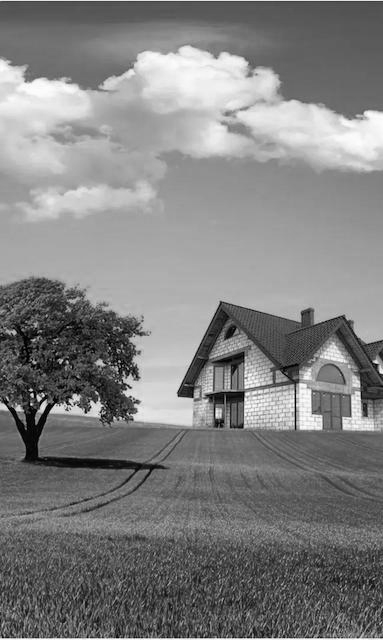

# Лабораторная работа №2
  
Выполнил: Юрочкин Денис Б20-514
### Оттенки серого
  

### Оттенки серого (как в Photoshop)
  

### Бинаризация (балансировка гистограммы)
  

### Оттенки серого
  

### Оттенки серого (как в Photoshop)
  

### Бинаризация (балансировка гистограммы)
  

### Оттенки серого
  

### Оттенки серого (как в Photoshop)
  

### Бинаризация (балансировка гистограммы)
  
