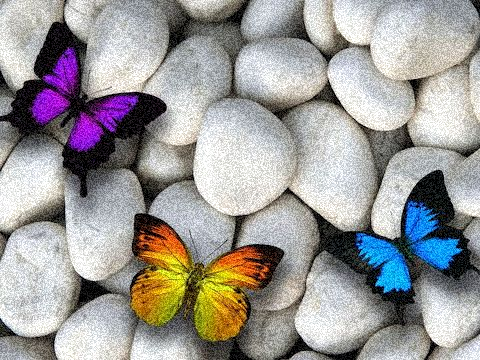
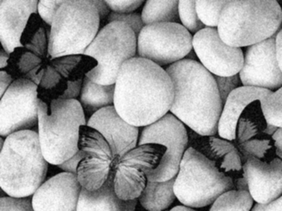
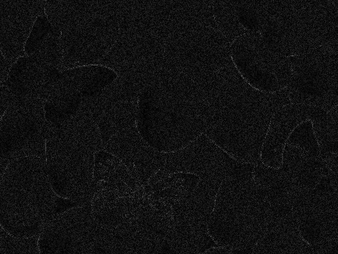
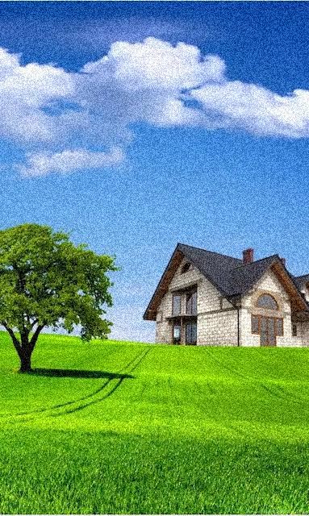
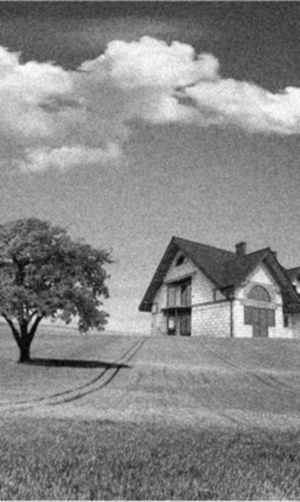
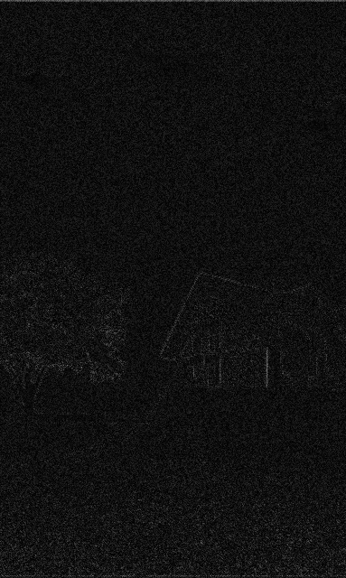

# Лабораторная работа №3
  
Выполнил: Юрочкин Денис Б20-514
### Исходная картинка
  

### Пространственное сглаживание
  

### Разница сглаженной и исходной
  

### Исходная картинка
  

### Пространственное сглаживание
  

### Разница сглаженной и исходной
  
